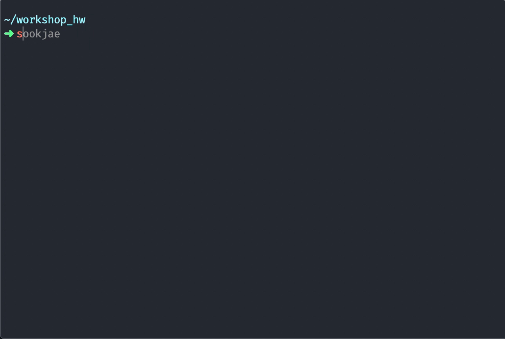

# 📦 sookjae

SSAFY 숙제 제출 폴더와 파일을 쉽게 만들어주는 npm 패키지

ex) 26번째 숙제를 해야할 때 `sookjae` 실행 뒤 `26` 을 입력하면 아래 폴더와 파일이 생성됩니다.

* 26/

  * 26-homework.md

    ```markdown
    # 26 Homework
    ```

    

  * 26-workshop.md 

    ```markdown
    # 26 workshop
    ```


&nbsp;

## 🚀 Install

npm을 이용해 전역으로 설치해주세요.

```bash
npm i -g sookjae
```


&nbsp;

## 💡 Usage

숙제를 제출하는 폴더 경로로 이동한 뒤, 명령어를 입력해주세요.

```bash
sookjae
```


### How to use




